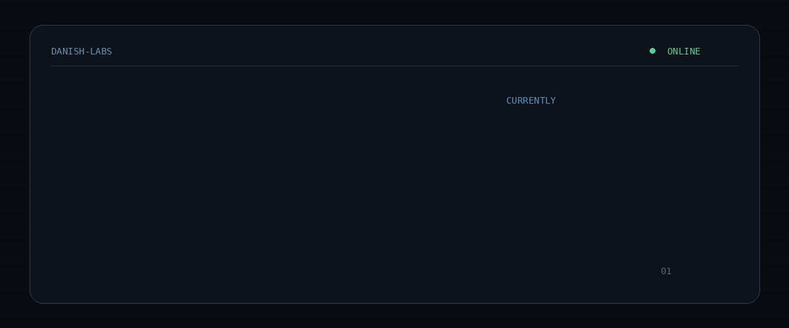

  

### Engineering Student · Developer · Linux Enthusiast

Building · Learning · Experimenting

---

## 👨‍💻 About Me

I'm an Engineering student interested in **software development, systems,
automation and emerging technologies**.

My main areas of interest include:

- 💻 Software Development
- 🧩 Data Structures & Algorithms
- 🐧 Linux & Open Source
- 🤖 Artificial Intelligence & Machine Learning
- 🔐 Cybersecurity
- 🕷️ Web Scraping & Browser Automation
- 🌐 IoT & Connected Systems
- ☁️ Cloud Computing

I prefer learning by **building real projects** rather than just collecting
technology names in a README.

---

## 🛠️ Tech Stack

### 💻 Languages

### 🌐 Web & Mobile

### 🕷️ Automation & Scraping

### 🤖 AI & Machine Learning

### ☁️ Cloud & Backend

### 🌐 IoT & Connected Systems

### 🔐 Cybersecurity

### 🐧 Tools & Environment

---

## 🧠 What I'm Exploring

<table>
<tr>
<td width="50%">

### 🤖 AI & Machine Learning

Exploring AI systems, machine learning concepts,
generative AI, local models and practical applications.

</td>

<td width="50%">

### 🔐 Cybersecurity

Learning networking, Linux security,
security concepts and ethical security practices.

</td>
</tr>

<tr>
<td width="50%">

### 🐧 Linux & Systems

Working with Linux environments, command-line
tools, scripting and system internals.

</td>

<td width="50%">

### 🌐 Web & Automation

Building web applications, scraping systems,
browser automation and programmable workflows.

</td>
</tr>

<tr>
<td width="50%">

### ☁️ Cloud Computing

Exploring cloud technologies, backend systems,
APIs and scalable application concepts.

</td>

<td width="50%">

### 🌐 IoT & Connected Systems

Exploring connected devices, automation,
embedded systems and IoT applications.

</td>
</tr>
</table>

---

## 🚀 Projects

I believe projects should demonstrate **what I can build**, not just
what technologies I have heard of.

### 🔭 Current Direction

<pre>
DSA
 │
 ├── Problem Solving
 ├── C
 └── C++

Web Development
 │
 ├── JavaScript
 ├── TypeScript
 └── React

Python
 │
 ├── Automation
 ├── Web Scraping
 └── AI / ML

Linux
 │
 ├── Bash
 ├── Git
 └── Systems

Cybersecurity
 │
 ├── Networking
 ├── Linux Security
 └── Security Concepts

IoT
 │
 ├── Connected Systems
 ├── Automation
 └── Embedded Technologies
</pre>

### 🚧 Featured Projects

> Projects will be added here as they become polished and public.

---

## 📚 Currently Learning

- 🧩 Data Structures & Algorithms
- 🐍 Advanced Python
- ⚡ JavaScript & TypeScript
- 🌐 Web Development
- 🐧 Linux & Bash
- 🤖 AI / Machine Learning
- 🔐 Cybersecurity
- ☁️ Cloud Computing
- 🌐 IoT & Automation

---

## 📊 GitHub

---

## ⚡ Development Philosophy

<pre>
Build → Break → Understand → Fix → Improve
</pre>

---

## 🎯 Goals

- [ ] Build more real-world projects
- [ ] Improve DSA & problem solving
- [ ] Build full-stack applications
- [ ] Explore AI / ML
- [ ] Work with local AI models
- [ ] Improve Linux & system knowledge
- [ ] Learn more about Cybersecurity
- [ ] Explore Cloud Computing
- [ ] Build IoT projects
- [ ] Contribute to Open Source
- [ ] Build useful developer tools

---

## 📫 Connect

---

### `Keep building.`

 

Made with curiosity, code, Linux and probably too much terminal time.

